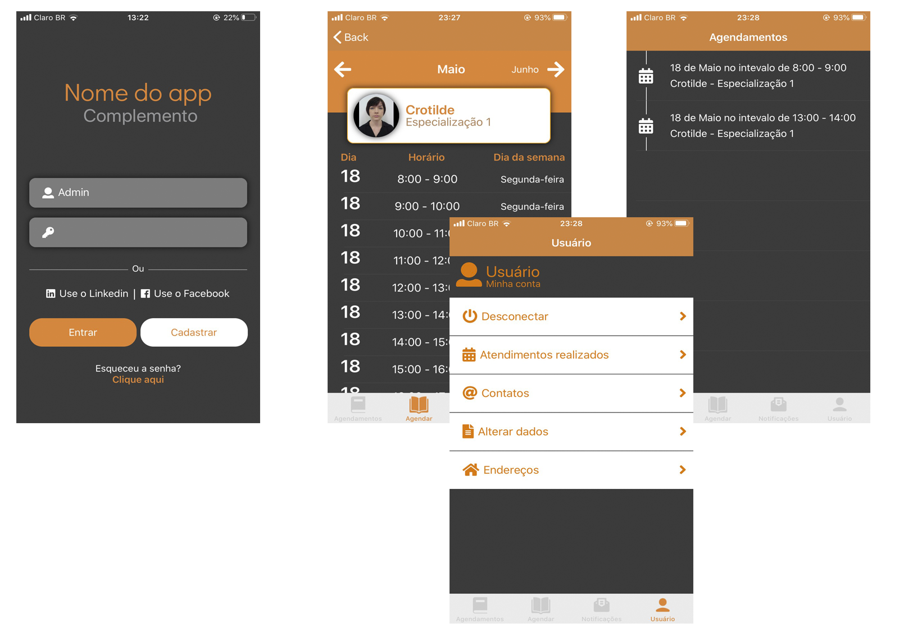

# XamarinReference
O Octus é um aplicativos que pode ser usado por qualquer seguimento que ofereça agendamento com profissionais. Salões de beleza, Advogados, Dentistas, Clínicas...

O cliente final pode selecionar a especialidade desejada, o profissional e, em uma tela bem simples, com um único click, selecionar o dia e horário do atendimento.

|  |
| :--: | 
